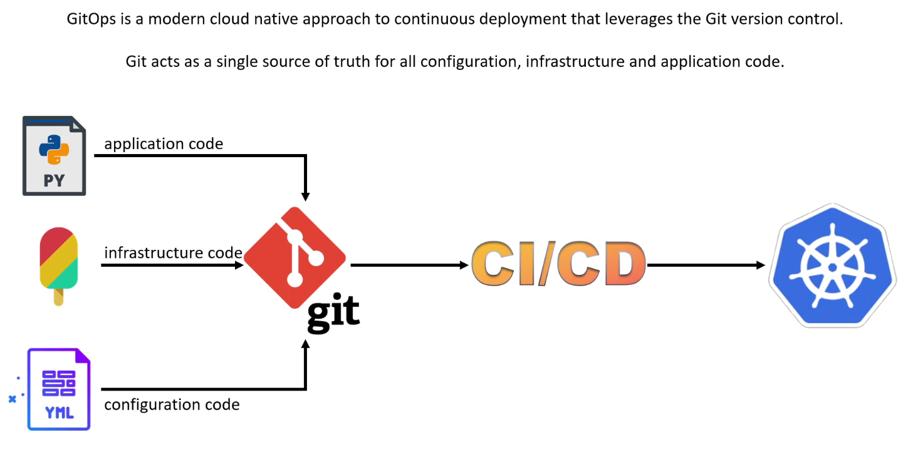
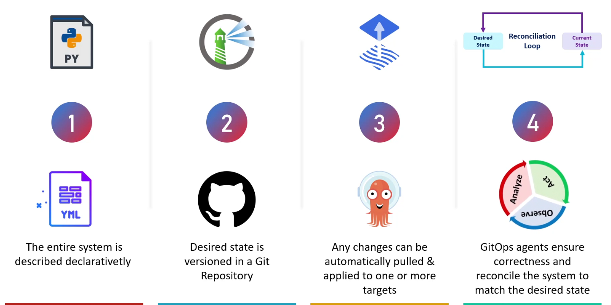

### GitOps
GitOps is a modern approach to Kubernetes and cloud-native infrastructure management where Git is used as the `single source of truth` for declarative infrastructure and applications.

### Principles of GitOps
**Dechlarative Description**:
- All system configurations are described using code `(YAML/JSON/Kustomize/Helm)`.
- These files declare what the desired state of the system should be.

**Version Control (Git as the Source of Truth)**
- All declarative configurations are stored in a Git repository.
- Git provides versioning, history, and collaboration (PRs, approvals).

**Automated Reconciliation**
- An agent (like Flux CD) watches Git for changes and continuously reconciles the cluster state to match the Git state.
- No manual kubectl apply; the agent makes it happen.

**Pull-based Deployments**
- Flux and similar tools pull updates from Git and apply them.
- This is more secure than push-based models, where CI/CD systems push to the cluster.

**Continuous Delivery via Git**
- Changes are applied to the cluster when merged into `Git`, no need to interact with the cluster directly.

