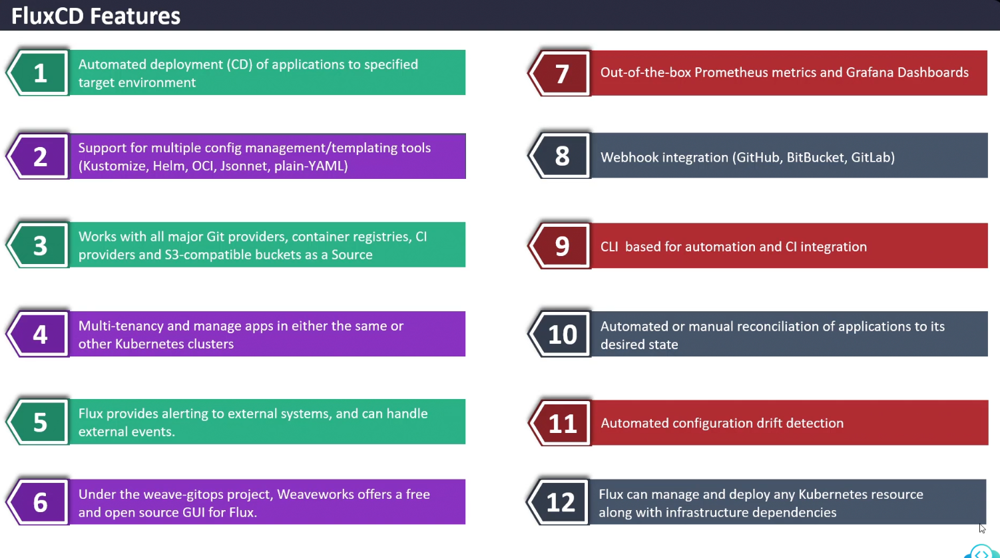

## Key Concepts and Terminology

### 1. **GitOps**

* A **deployment methodology** where Git is the **single source of truth**
* All changes go through Git (usually via Pull Requests).
* Flux continuously reconciles the cluster to match what's in Git.

---

### 2. **Source**

* The *Git repository* (or other sources like Helm repos, OCI registries) where your YAMLs or Helm charts live.
* Managed via the `GitRepository`, `HelmRepository`, or `Bucket` custom resources.

---

### 3. **Kustomization**

* Represents the **sync configuration** for a set of Kubernetes manifests.
* Tells Flux how to apply what's in a Git repo path to the cluster.

> Think of it like:
> "Pull these files from Git and apply them to the cluster."

---

### 4. **Reconciliation**

* The process where Flux checks the desired state (in Git) and compares it to the actual state (in the cluster).
* If there's a mismatch, Flux **applies changes** until they match.
* This is **automated** and happens **continuously**.

---

### 5. **Controllers**

FluxCD is made up of several **controllers**

| Controller                    | Role                         |
| ----------------------------- | ---------------------------- |
| `source-controller`           | Manages Git/Helm/OCI sources |
| `kustomize-controller`        | Applies Kubernetes YAML      |
| `helm-controller`             | Installs Helm charts         |
| `notification-controller`     | Sends alerts (Slack, etc.)   |
| `image-automation-controller` | Automates image updates      |

---

### 6. **Helm in Flux**

* Helm charts are supported natively.
* You use `HelmRelease` objects to manage Helm deployments declaratively.

---

### 7. **Image Automation**

* Allows **automated image updates** by scanning container registries.
* Common for auto-deploying new versions of your app.

---

### 8. **Bootstrap**

* The command `flux bootstrap` sets up Flux in a cluster and links it to a Git repo.
* Initializes all necessary components.

---

## Flux Features

