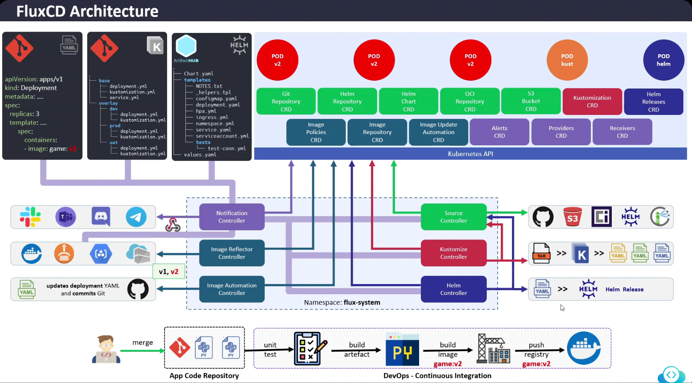

## **FluxCD Architecture Overview**

1. **Source Controller**:
    * Responsible for managing the **Git repositories**, **Helm repositories**, and **Bucket resources**.
    * It fetches the manifests or Helm charts from the source and ensures the latest state is available for reconciliation.

2. **Kustomize Controller**:
    * The **Kustomize controller** is responsible for handling and applying Kustomization resources, which allow the use of Kustomize to manage overlays and patches to Kubernetes resources.
3. **Helm Controller**:

    * The **Helm controller** helps manage **Helm releases**. It applies and updates Helm charts, ensuring the desired Helm releases are installed in the cluster.

4. **Notification Controller**:

    * The **Notification controller** sends notifications and alerts (e.g., to Slack, email, or custom webhooks) to let users know about important events such as updates, failures, or errors during the reconciliation process.

5. **Image Automation Controller**:

    * Responsible for monitoring **container image repositories** and automatically updating Kubernetes manifests when new images are pushed to the registry (like a new version of a Docker container).

---

