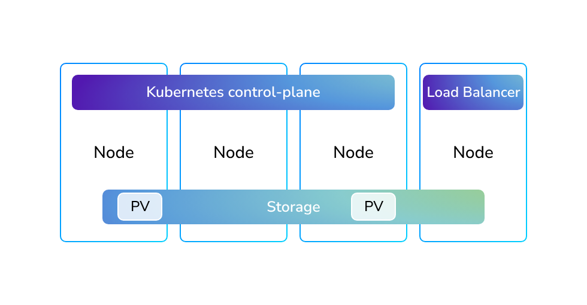

## How Modern Cloud K8s Works
Kubernetes enables treating virtual machines as ephemeral, disposable resources rather than permanent infrastructure.
VMs can be deleted and recreated freely without disrupting applications because:
- The Kubernetes control plane maintains cluster state
- Load balancers automatically redirect traffic to new nodes
- Data persists in external cloud-provided volumes, not inside VMs

This approach shifts VMs from stateful servers to stateless utilities for running workloads.

## Kubernetes on bare metal:

Kubernetes nodes lifecycle on bare metal can be managed in several ways:

| Approach                                  | Good for                              | How updates happen                                  |
| ----------------------------------------- | ------------------------------------- | --------------------------------------------------- |
| **Cloud (immutable VMs)**                 | Dynamic cloud workloads               | Replace VMs with new images                         |
| **In-place updates (kubeadm, Kubespray)** | Traditional bare metal                | Upgrade on the node itself                          |
| **Cluster API + Metal³**                  | Declarative bare metal automation     | Use API to manage machines like cloud               |
| **Talos Linux hybrid**                    | Declarative config with fewer reboots | Apply config changes, some without recreating nodes |

